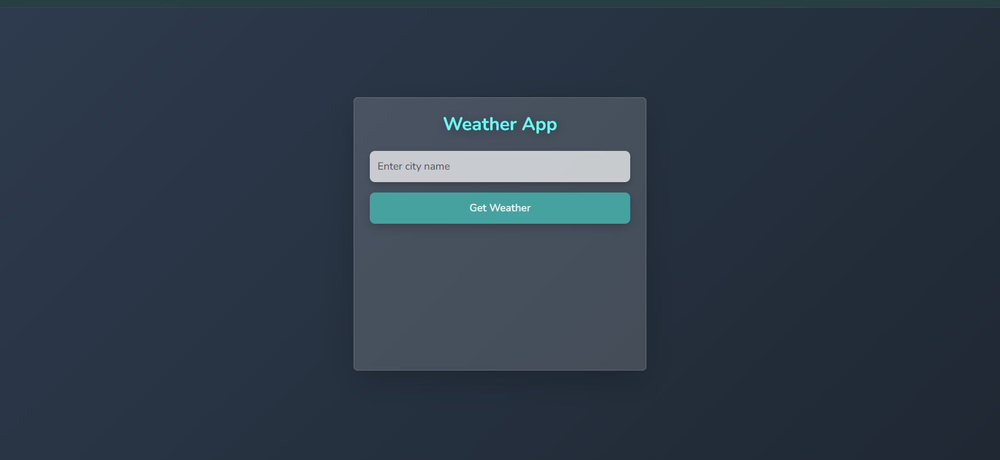
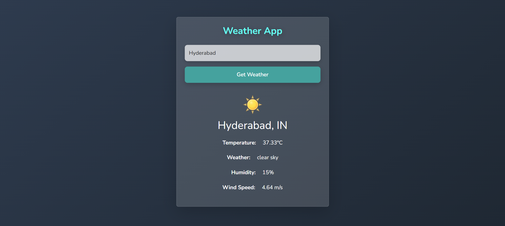
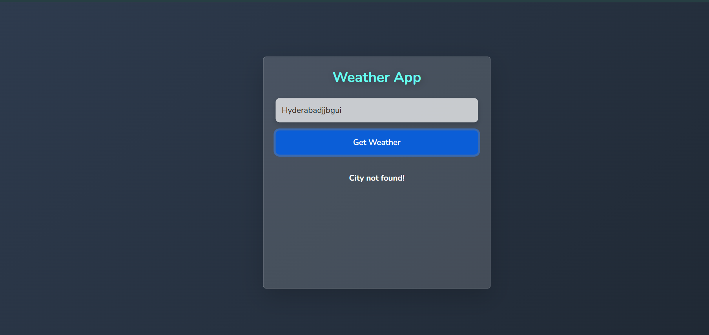

# Weather API Project

A simple weather application built using HTML, CSS, and JavaScript to fetch and display real-time weather data.

## Features
- Search any city to get live weather updates  
- Displays temperature, humidity, wind speed, and weather conditions  
- Responsive design for all devices  
- Error handling for invalid inputs  

## Technologies Used
- HTML  
- CSS  
- JavaScript  
- Weather API  

## Screenshots  
  
  
  

## How to Run  
1. Clone the repository:  
   [Weather API Repository](https://github.com/JAT-SANDEEP8117/WEATHERAPI.git)  
2. Open the project folder.  
3. Open `index.html` in any web browser.  
